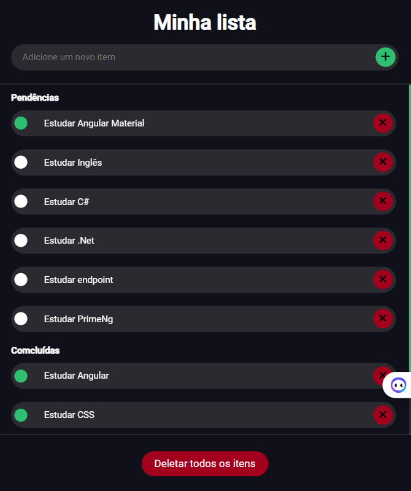
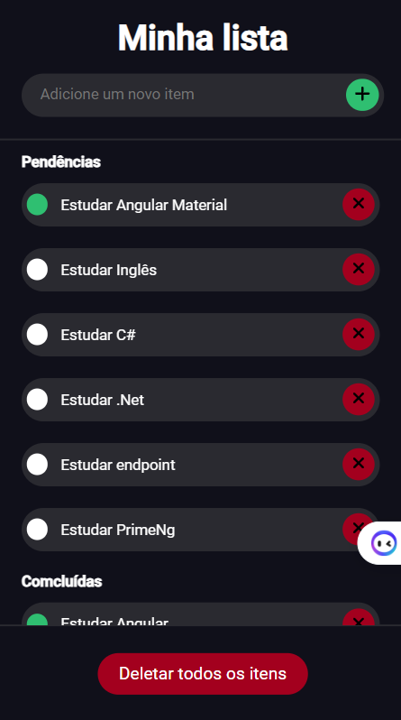
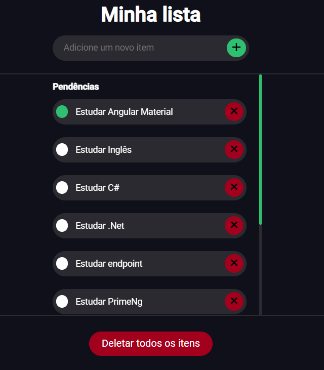

# Lista de Tarefas

Organize suas tarefas diárias

## índice

- <a href="#layout">Layout</a>
- <a href="#Demonstracao">Demonstraçao</a>
- <a href="#rodar">Como rodar o projeto?</a>
- <a href="#tecnologias">Tecnologias Utilizadas</a>
- <a href="#autor">Autor</a>

## Layout








## Demonstraçao

[Link demonstração]()

## Como rodar o projeto?

```bash
# Clone este repositório
$ git clone linkrepo
# Acessa a pasta do projeto no seu teminal
$ cd lista-de-tarefas
# execute o comando npm install
$ use o comando ng server para rodar a aplicação na porta  http://localhost:4200/

```

## 🛠Tecnologias Utilizadas
1. [html](https://developer.mozilla.org/pt-BR/docs/Web/HTML)
2. [scss](https://developer.mozilla.org/pt-BR/docs/Web/CSS)
2. [Angular 17](https://angular.dev/)
2. [Sweetalert2](https://sweetalert2.github.io/)

## Autor 

.jpeg)

[linkedIn](https://www.linkedin.com/in/emilio-jos%C3%A9-794955208/)
